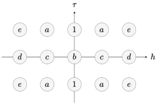
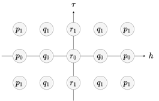

# Практическое занятие: Численное решение уравнения Рода

## Обзор

На этом занятии мы будем исследовать численные решения уравнения Стержня с помощью различных конечно-разностных схем. Основное внимание будет уделено стандартной схеме Кранка-Николсона и разработке компактных схем, с целью понять их реализацию и эффективность при численном решении уравнения Стержня.

## Цели

1. Понять дискретизацию уравнения стержня и ее последствия.
2. Реализовать схему Кранка-Николсона и компактную схему в MATLAB.
3. Проанализировать точность и устойчивость численных решений.

## Раздел 1: Теоретические основы

### Стержневое уравнение и дискретизация

Мы рассматриваем уравнение стержня, которое в упрощенном виде можно выразить как:

$$
\frac{\partial^2 u}{\partial t^2} - D \frac{\partial^4 u}{\partial x^2 \, \partial t^2} + C \frac{\partial^4 u}{\partial x^4} =  f(t, x),
$$

где коэффициенты $D = R^2$, $C = E R^2 / \rho$, $x$ - пространственная переменная, $t$ - время, $\rho>0$ - плотность материала стержня, $R$ - радиус поперечного сечения, $E$ - модуль Юнга материала. Правая часть $f(t,\, x)$ является вынуждающей.

В процессе дискретизации вводится временной шаг $\tau$ и пространственный шаг $h$, что приводит к определению безразмерных параметров $\nu = C \tau^2/h^4$ и $\mu = D/h^2$.

### Граничные условия

Мы применяем периодические граничные условия, подразумевающие эквивалентность значений на левой и правой границах пространственной области.

## Раздел 2: Численная постановка задачи

### Определение сетки и временного шага

Учитывая длину стержня $L$, мы вычисляем пространственный шаг $h = L/N$ для $N$ пространственных точек.

> Помните, что здесь $N$ - это число неизвестных значений функции $u$. Поскольку мы используем периодические граничные условия, у нас всего $N+1$ пространственных точек, где последняя точка совпадает с первой.

Временной шаг $\tau$ рассчитывается на основе $h$ и **фиксированного** безразмерного параметра $\nu$.

### Эталонные решения

Для численных экспериментов мы рассмотрим эталонное решение $u^\mathrm{ref}$, чтобы сравнить его с полученным численным решением $u$ и оценить нормы погрешности.

## Раздел 3: Реализация в MATLAB

### Задача 3.1: Настройка дискретной сетки

Создайте дискретную сетку в MATLAB, учитывая количество пространственных точек $N$ и временных шагов $M$.

### Задача 3.2: Вычисление коэффициентов

Рассчитайте коэффициенты для схемы CN и компактной схемы "5-5-5" по приведенным формулам.




**Code Snippet**:

```matlab
% Coefficients for CN Scheme
alpha = 1 + 3*nu + 2*mu;
% Left part
a = -(2*nu + mu) / alpha;
b = -(2 + 4*mu) / alpha;
c = 2*mu / alpha;
d = 0;
e = nu/2 / alpha;
% Right part
p0 = 0;
p1 = 0;
q0 = 0;
q1 = 0;
r0 = 0;
r1 = tau^2/2 / alpha;
```

```matlab
% Coefficients for "5-5-5" Scheme
alpha = 72*(41 + 30*nu + 90*mu);
% Left part
a = 96*(7 - 15*nu - 30*mu) / alpha;
b = -144*(41 - 150*nu + 90*mu) / alpha;
c = -192*(7 + 75*nu - 30*mu) / alpha;
d = -24*(1 - 150*nu - 30*mu) / alpha;
e = 12*(1 + 30*nu - 30*mu) / alpha;
% Right part
p0 = 10*tau^2 / alpha;
q0 = 560*tau^2 / alpha;
r0 = 2460*tau^2 / alpha;
p1 = tau^2 / alpha;
q1 = 56*tau^2 / alpha;
r1 = 246*tau^2 / alpha;
```

## Раздел 4: Сравнение численных схем

### Задача 4.1: Определите параметры задачи

Рассмотрим сценарий со стальным стержнем со следующими физическими параметрами:

```matlab
rho = 7900;
R = 10^-3;
E = 210e9;
L = 2*pi;
```

Задайте время интегрирования `T = 1` и количество пространственных точек `Nx = 50`. Также установите безразмерный параметр $\nu = C \tau^2/h^4$ равным $0.1$. Вычислите соответствующий шаг по времени $\tau$.

```matlab
T = 1;
Nx = 100;
nu = 0.1;

x = linspace(0, L, Nx + 1);
h = x(2) - x(1);
D = R^2;
C = E*R^2/rho;
mu = D/h^2;

% Secondary parameters
tau = sqrt(nu*h^4 / C);
Nt = ceil(T/tau) + 1; % Including the t = 0 and the first step beyond T
T_final = tau * (Nt-1);
t = linspace(0, T_final, Nt);
```

Наконец, определите опорное решение и соответствующее ему принуждение:

```matlab
% Reference soltuion
u_ref = @(t, x) sin(x + t*sqrt(C/(D+1)));
f_ref = @(t, x) zeros(size(x));
```

### Задание 4.2: Реализация схем CN и "5-5-5"

Реализуйте схемы CN и "5-5-5" в MATLAB и решите уравнение стержня численно. Начните с определения матриц перехода для левой и правой частей.

**Code Snippet**:

```matlab
U_next = eye(Nx) + diag(a*ones(Nx-1, 1), 1) + diag(a*ones(Nx-1, 1), -1) + ...
    diag(e*ones(Nx-2, 1), 2) + diag(e*ones(Nx-2, 1), -2);
U_now = b*eye(Nx) + diag(c*ones(Nx-1, 1), 1) + diag(c*ones(Nx-1, 1), -1) + ...
    diag(d*ones(Nx-2, 1), 2) + diag(d*ones(Nx-2, 1), -2);

F_next = r1*eye(Nx) + diag(q1*ones(Nx-1, 1), 1) + diag(q1*ones(Nx-1, 1), -1) + ...
    diag(p1*ones(Nx-2, 1), 2) + diag(p1*ones(Nx-2, 1), -2);
F_now = r0*eye(Nx) + diag(q0*ones(Nx-1, 1), 1) + diag(q0*ones(Nx-1, 1), -1) + ...
    diag(p0*ones(Nx-2, 1), 2) + diag(p0*ones(Nx-2, 1), -2);

% Periodic boundary conditions
U_next(1, end-1:end) = [e a];
U_next(2, end) = e;
U_next(end-1, 1) = e;
U_next(end, 1:2) = [a e];

U_now(1, end-1:end) = [d c];
U_now(2, end) = d;
U_now(end-1, 1) = d;
U_now(end, 1:2) = [c d];

F_next(1, end-1:end) = [p1 q1];
F_next(2, end) = p1;
F_next(end-1, 1) = p1;
F_next(end, 1:2) = [q1 p1];

F_now(1, end-1:end) = [p0 q0];
F_now(2, end) = p0;
F_now(end-1, 1) = p0;
F_now(end, 1:2) = [q0 p0];

U_prev = U_next;
F_prev = F_next;
```

Теперь реализуйте численный метод.

```matlab
% Integration
u = zeros(Nt, Nx);
u(1, :) = u_ref(0, x(1:end-1));
u(2, :) = u_ref(tau, x(1:end-1));
[x_gr, t_gr] = meshgrid(x(1:end-1), t);

f = f_ref(t_gr, x_gr);

for k = 3 : Nt
    rhs = -U_now*u(k-1, :).' - U_prev*u(k-2, :).' + ...
        F_next*f(k, :).' + F_now*f(k-1, :).' + F_prev*f(k-2, :).';
    u(k, :) = U_next \ rhs;
end
u = [u, u(:, 1)];
```

## Раздел 5: Анализ ошибок

### Задача 5.1: Вычисление нормы погрешности

Вычислите $C$ и $L^2$ нормы погрешности между опорным решением и численным решением, полученным по каждой схеме в конечный момент времени. Для этого запустите численное моделирование для выбранной схемы для нескольких значений $N$, выполнив функцию `rod_integration` (создана из кода выше). Каждый раз вычисляйте и сохраняйте ошибки.

```matlab
scheme = "CN";
Nx_set = [12, 25, 50, 100];

C_norm = zeros(length(Nx_set), 1);
L2_norm = zeros(length(Nx_set), 1);

for n = 1:length(Nx_set)
    Nx = Nx_set(n);
    [u, T_final] = rod_integration(Nx, scheme, ...) % and other parameters, if necessary

    diff_u = u_ref(T_final, x) - u(end, :)
    C_norm(n) = max(abs(diff_u));
    L2_norm(n) = sqrt(trapz(x, diff_u.^2));
end
```

### Задание 5.2: Визуализация

Визуализируйте нормы погрешности.

**Code Snippet**:

```matlab
figure(1);
loglog(Nx_set, C_norm);
xlabel('N_x');
title('C norm');

figure(2);
loglog(Nx_set, L2_norm);
xlabel('N_x');
title('L^2 norm');
```

## Заключение

Подведите итоги практического занятия, подчеркнув различия в точности между схемами.
