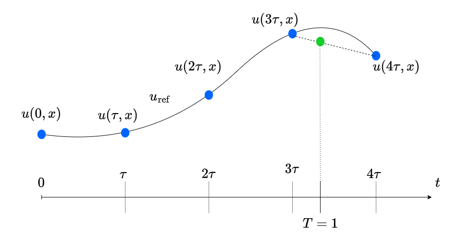

# Rod Equation: Advanced Computational Topics

## Rod Equation and Discretization

We consider the rod equation, which can be expressed in its simplified form as:

$$
\frac{\partial^2 u}{\partial t^2} - D \frac{\partial^4 u}{\partial x^2 \partial t^2} + C \frac{\partial^4 u}{\partial x^4} =  f(t, x),
$$

where the coefficients $D = R^2$, $C = E R^2 / \rho$, $x$ is a spatial variable, $t$ is time, $\rho>0$ is the density of the rod material, $R$ is the cross-section radius, and $E$ is Young's modulus of the material. The right part $f(t, x)$ is a forcing.

The discretization process introduces a temporal step $\tau$ and a spatial step $h$, leading to the definition of dimensionless parameters $\nu = C \tau^2/h^4$ and $\mu = D/h^2$.

## 1. Interpolation to the Final Time Moment

Usually, for the numerical simulations we set an upper integration time limit `T`. So, we expect the computational method, like, *Crank-Nicolson scheme* or a *Compact scheme* to produce the numerical solution on the time interval $t \in [0, T]$. However, by introducing the spatial step `h` and the temporal step `tau` we can only calculate the values of the unknown function $u(t, x)$ at predetermined temporal-spatial points.

For example, consider the final time of interest to be `T = 1` and the temporal step `tau = 0.3`. Then, we can only compute the function `u` at times `t = [0, 0.3, 0.6, 0.9, 1.2]`. Here, the initial conditions are set at time `t = 0` and we continue integration until the first time we exceed the desired time `T`. In this case, the total number of temporal points `Nt` needed to compute the solution is the number of temporal steps required to exceed the desired time `T` plus one for the initial time moment `t = 0`. A sample code snippet may have the following form:

```matlab
T = 1;
tau = 0.3;
Nt = ceil(T/tau) + 1;
```



On the figure above, the solid black line represents the reference solution `u_ref`, and the blue dots correspond to the calculated values of the function `u`.

To get the value of the function `u` at the desired time `T`, we can interpolate the values using one of the available methods:

- **1-D interpolation**: Consider each slice of the function `u` along the spatial coordinate `x` as an independent function of time `t`, and perform `Nx` interpolations to time `T`. Combine `for` cycle and [`interp1`](https://www.mathworks.com/help/releases/R2023b/matlab/ref/interp1.html) function;
- **2-D interpolation**: Consider spatial and temporal variables simultaneously, and perform gridded interpolation using [`interp2`](https://www.mathworks.com/help/releases/R2023b/matlab/ref/interp2.html).

Usually, interpolation techniques allow different `method` parameters:

- **Linear** interpolation,
- **Cubic** interpolation (based on cubic convolution),
- **Spline** interpolation,
- and others.

Here, cubic convolution interpolation employs a kernel-based approach focusing on local smoothness, using a weighted average determined by a cubic polynomial. In contrast, cubic spline interpolation constructs a globally smooth, piecewise cubic polynomial that passes exactly through all known data points, emphasizing continuity and smoothness across the entire range, making it suitable for mathematical modeling and data fitting where precise data representation is crucial.

It is up to the user to define which method works the best in a particular problem. A code snippet may look as follows:

```matlab
x = linspace(0, L, Nx + 1);

% Solve the rod equation for the given parameters and scheme
% Nx - number of spatial points;
% L - length of the rod;
% T - desired final time;
% rho, R, E - parameters of the rod;
% nu - dimensionless parameter, nu = (E*R^2/rho) * tau^2 / h^4;
% scheme - one of the computational schemes, e.g., "CN" or "555";
% u_ref, f_ref - function handles to the reference solution and the external force.
% OUTPUT:
% t - column vector of Nt time moments at which the solution is calculated;
% u - matrix of the size [Nt, Nx] with the numerical approximation of the unknown function.
[t, u] = solveRodEquation(Nx, L, T, rho, R, E, nu, scheme, u_ref, f_ref);

u_numerical = interp2(x, t, u, x, T, "spline");
```

---

## 2. Approxaimtion of the Boundary Conditions

The nature of the rod equation requires two boundary conditions at each end. There are different boundary conditions that can be posed for the boundary-value problem of the rod equation, see the examples:


We will focus on two of them, to which by this day the appropriate approximations are found but not published yet. Without loss of generality, consider the left end of the rod `x = 0` at a time `t`.

- **Pinched end.** (c) The deflection and the angle of rotation are equal to zero: $u(t, 0) = 0$, and $\partial_x u(t, 0) = 0$.
- **Hinged-supported end.** (b) The deflection and bending moment at the edge are equal to zero: $u(t, 0) = 0$, and $\partial^2_x u(t, 0) = 0$.

### Naive Approximation

A straightforward way to implement a boundary condition which includes spatial derivatives is to substitute its differentiation operators with the corresponding discrete approximation. For example, a directional approximation of the first derivative is

$$
\partial_x u(t, 0) \approx \frac{u(t, h) - u(t, 0)}{h}
$$

So, the **pinched end** boundary condition on the left edge can be transformed into two requirements:

1. $u(t, 0) = 0$,
2. $u(t, h) = u(t, 0)$, or simply $u(t, h) = 0$.

The directional approximation of the second derivative that uses four spatial steps is

$$
\partial_x^2 u(t, 0) \approx \frac{2u(t, 0) - 5u(t, h) + 4u(t, 2h) - u(t, 3h)}{h^2}.
$$

For other options, see [Finite Difference Coefficients Calculator
](https://web.media.mit.edu/~crtaylor/calculator.html).

To conclude, the **Naive Approximation** of the pinched end and hinged-supported end can be approximated as two conditions for each case:

| No. |  | Pinched End | Hinged-Supported End |
|---|---|---|---|
| 1. | $u(t, 0) = $ | 0 | 0 |
| 2. | $u(t, h) = $ | 0 | $[4u(t, 2h) - u(t, 3h)]/5$ |

Note that we implement a computation scheme (*CN* or *555*) at the spatial points $x = 2h$, $x = 3h$ and others, so in this context they are assumed to be given.

### Compact Approximation

The construction of the compact approximation of the boundary conditions shares similarities with the construction of the compact schemes for the rod equation itself.

> Define the stencil or a template with unknown coefficients and find them by solving a system of linear algebraic equations (SLAE) using reference solutions.

The naive approach approximates the boundary conditions using only one time moment `t`. Assuming we know the values of the function `u` at the previous time step $t - \tau$, we can incorporate it into our stencil.


Here, the coefficients $\alpha$ stand for the left-hand side of the border conditions of the rod equation, and the coefficients $\beta$ are for the external forcing. The lower index indicates the spatial offset from the left border, while the top index corresponds to the temporal offset.

**Independent Boundary Conditions:** We need two boundary conditions at each end. To distinguish between them in the chosen stencil, we consider two normalizations.

| No. | $\alpha_0^0$ | $\alpha_1^0$ |
|---|---|---|
| 1 | 1 | 0 |
| 2 | 0 | 1 |

This will ensure the independence between two sets of stencil coefficients. Therefore, the number of unknown coefficients in the chosen boundary approximation stencil is equal to six.

The test functions $u_\text{test}$ should satisfy the considered boundary conditions and the rod equation. So, once we find a test function that fits two boundary conditions on the left edge, we substitute it into the rod equation to get $f_\text{test}$.

#### Compact Approxaimation: Pinched Edge

This problem is characterized by two boundary conditions:

$$
u(t, 0) = 0, \quad \partial_x u(t, 0) = 0.
$$

A test function $u_\text{ref}$ should be a monomial and it should satisfy both conditions. For example, the simplest monomial is $u_\text{ref}(t, x) = x^2$. Substituting it into the rod equation gives us $f_\text{ref} = 0$. So, applying these two reference functions into the boundary condition stencil for two possible normalizations, we get

$$
1 \cdot 0 + 0 \cdot h^2 + (\alpha_2^0 + \alpha_2^1) \cdot (2h)^2 + (\alpha_3^0 + \alpha_3^1) \cdot (3h)^2 = \beta_0^0 \cdot 0 + \beta_1^0 \cdot 0,
$$

$$
0 \cdot 0 + 1 \cdot h^2 + (\alpha_2^0 + \alpha_2^1) \cdot (2h)^2 + (\alpha_3^0 + \alpha_3^1) \cdot (3h)^2 = \beta_0^0 \cdot 0 + \beta_1^0 \cdot 0.
$$

Here, the first equation contributes to the SLAE of the boundary value $u(0, 0)$, and the second equation is part of the SLAE of the pre-boundary value $u(0, h)$. The full set of reference functions is thus as follows:

| No. | $u_\text{ref}$ | $f_\text{ref}$ | Border Equation | Pre-border Equation |
|---|---|---|---|---|
| 1 | $x^2$ | $0$ | $4(\alpha_2^0 + \alpha_2^1) h^2 + 9(\alpha_3^0 + \alpha_3^1) h^2 = 0$ | $h^2 + 4(\alpha_2^0 + \alpha_2^1) h^2 + 9(\alpha_3^0 + \alpha_3^1) h^2 = 0$ |
| 2 | $x^3$ | $0$ |  |  |
| 3 | $x^4$ | $24C$ |  |  |
| 4 | $t x^2$ | $0$ |  |  |
| 5 | $t x^3$ | $0$ |  |  |
| 6 | $t^2 x^2$ | $2x^2 - 4D$ |  |  |

Solving two systems with respect to the unknown coefficients we get the following results:

| Coefficient | Border Condition | Pre-border Condition |
|---|---|---|
| $\alpha_0^0$ | $1$ | $0$ |
| $\alpha_1^0$ | $0$ | $1$ |
| $\alpha_2^0$ | $0$ | $-1/2$ |
| $\alpha_3^0$ | $0$ | $1/9$ |
| $\alpha_2^1$ | $0$ | $0$ |
| $\alpha_3^1$ | $0$ | $0$ |
| $\beta_0^0$ | $0$ | $-\frac{h^4(2\mu - 1)}{12C}$ |
| $\beta_1^0$ | $0$ | $-\frac{h^4\mu}{6C}$ |

These coefficients will fill the transition matrices `U_next`, `U_now`, and `F_next` and `F_now`. Specifically, the coefficients of the **Border Conditions** solution fill the *first row* of the matrices, and the coefficients from the **Pre-border Conditions** form the *second row*.

- $\alpha_i^0$ constitute the first/second row of `U_next`;
- $\alpha_i^1$ constitute the first/second row of `U_now`;
- $\beta_i^0$ constitute the first/second row of `F_next`;
- $\beta_i^1$ constitute the first/second row of `F_now`.

If on the right edge of the rod we have the same boundary conditions, then the same coefficients form the last and the second from last rows of the transition matrices.

#### Compact Approxaimation: Hinged-Supported End

> To Do.

### Numerical Results

To compare the compact approximation of the border conditions with the naive approach we introduce a reference solution that satisfies the rod equation and the chosen boundary conditions. For example, for the **Pinched Edge** conditions we can choose $u_\text{ref}(t, x) = \cos(\omega t) \cdot \sin^2(x)$. In this case, the reference forcing is $f_\text{ref}(t, x) = \cos(\omega t) \cdot [(\omega^2 \cos(2x))/2 - \omega^2/2 - 8C\cos(2x) + 2D\omega^2\cos(2x)]$.

#### Numerical Results: Pinched Edge

The orders of the computational schemes CN and 555 when the *naive approximation* of the border conditions is used are presented in the following figure.


Here, $t^*$ indicates the time when the obtained and the reference solutions are compared. As we see, the *C-norm* of the error is large, indicating that the numerical solution is significantly different from the reference solution. The second or fourth order of the computational schemes observed for the periodic problem vanished because of the naive approximation of the boundary problem. In fact, the naive approach leads to a completely unreasonable solution $u$.

In contrast, when applying *compact approximation* of the **Pinched Edge** border conditions, the orders of the schemes are preserved or even improved.


