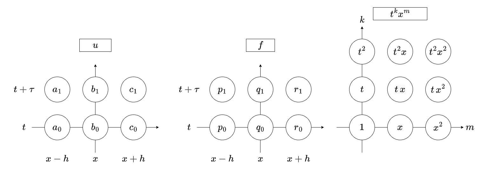
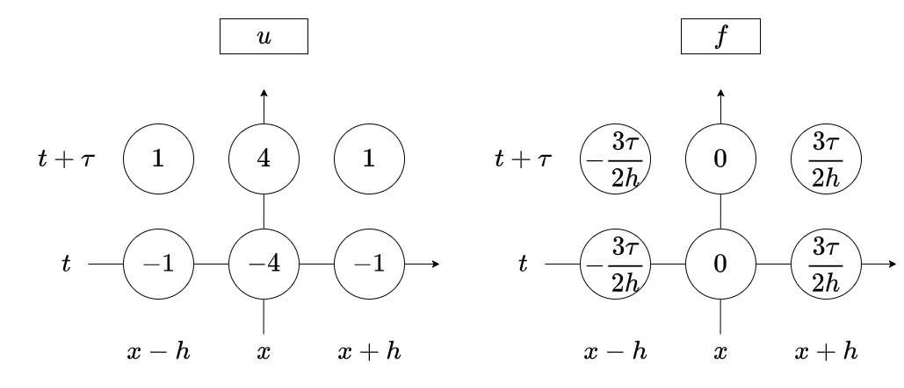

# Euler-Hopf Equation

## Problem statement

The Euler-Hopf equation, represented as

$$
\partial_t u + u \partial_x u = 0,
$$

embodies a quintessential non-linear partial differential equation. It arises in the study of fluid dynamics, specifically characterizing the evolution of waves or disturbances in shallow water contexts under the assumption of inviscid (frictionless) flow. This equation is pivotal for understanding characteristics in hyperbolic conservation laws and serves as a fundamental model for various nonlinear wave phenomena.

The domain of consideration is a segment $x \in [0, L]$ with periodic boundary conditions to simulate a continuous, circular wave pattern, where $L$ denotes the circumference length.

The Euler-Hopf equation is historically significant, first explored by Ludwig Prandtl and Theodore von Kármán in the context of aerodynamics to describe turbulence and vortex streets. Subsequently, Eberhard Hopf provided a detailed analysis, demonstrating its solutions and emphasizing its role in the mathematical physics of fluids. Its simplicity in form belies the complexity of its solutions and the richness of the phenomena it models, making it a staple example in the study of nonlinear differential equations and fluid mechanics.

## Numeric Integration

For the discretization of the Euler-Hopf equation, we introduce a spatial step, denoted as $h$, and a temporal step, denoted as $\tau$. The integration process begins with specifying an initial condition for the function $u$ at time $t=0$, which is given by:

$$
u(t, 0) = u_0(x),
$$

where $u_0(x)$ is a known function representing the initial state of the system.

### Explicit Schemes

This subsection discusses three explicit numerical schemes designed to approximate solutions to the Euler-Hopf equation. Despite their straightforward implementation and widespread use in various numerical analyses, particularly for nonlinear partial differential equations, these schemes have limitations. One notable challenge is the potential for the numerical solution to become unstable and exhibit unphysical growth, often described as the solution "exploding," under certain conditions. Nevertheless, understanding and analyzing these schemes provide valuable insights into the behavior of numerical methods for nonlinear problems.

#### Explicit Schemes: Euler Scheme

The Forward Euler scheme, a simple yet foundational approach, advances the solution through time by using the equation's current state to estimate its rate of change.

This equation can be approximated using an Euler scheme with the following form:

$$

$$


#### Explicit Schemes: MacCormack Scheme

The MacCormack scheme, a predictor-corrector method, offers a more refined approximation by initially predicting an advanced state and then correcting this estimate, enhancing stability and accuracy.

$$
\begin{aligned}
& \hat{u}_j^{n+1}=u_j^n-\frac{\tau}{h}\left[f\left(u_{j+1}^n\right)-f\left(u_j^n\right)\right] \\
& \tilde{u}_j^{n+1}=\frac{1}{2}\left\{u_j^n+\hat{u}_j^{n+1}-\frac{\tau}{h}\left[f\left(\hat{u}_j^{n+1}\right)-f\left(\hat{u}_{j-1}^{n+1}\right)\right]\right\}
\end{aligned}
$$


#### Explicit Schemes: Lax-Wendroff Scheme

The Lax-Wendroff scheme, developed to improve upon the basic Euler method, incorporates a Taylor series expansion to second order, aiming to better capture the wave propagation dynamics inherent in the Euler-Hopf equation.

$$
\begin{aligned}
& u_{j+\frac{1}{2}}^{n+\frac{1}{2}}=\frac{u_j^n+u_{j+1}^n}{2}-\frac{\tau}{h} \frac{f\left(u_{j+1}^n\right)-f\left(u_j^n\right)}{2} \\
& \tilde{u}_j^{n+1}=u_j^n-\frac{\tau}{h}\left[f\left(u_{j+\frac{1}{2}}^{n+\frac{1}{2}}\right)-f\left(u_{j-\frac{1}{2}}^{n+\frac{1}{2}}\right)\right]
\end{aligned}
$$


### Compact Correction

To introduce a compact correction scheme, let's first analyze a similar partial differential equation

$$
\partial_t u(t, x) = \partial_x f(t, x),
$$

where $f$ represents an arbitrary forcing function. We devise a compact scheme employing a two-step approach in time and a three-step method in space, which culminates in a system with 12 undetermined coefficients:

$$
\begin{aligned}
& a_1 u_{j-1}^{n+1}+b_1 u_j^{n+1}+c_1 u_{j+1}^{n+1}+a_0 u_{j-1}^n+b_0 u_j^n+c_0 u_{j+1}^n \\
=& p_1 f_{j-1}^{n+1}+q_1 f_j^{n+1}+r_1 f_{j+1}^{n+1}+p_0 f_{j-1}^n+q_0 f_j^n+r_0 f_{j+1}^n .
\end{aligned}
$$

To determine these coefficients, we apply test functions in monomial forms $t^k x^m$.



The choice of test functions is guided by their relevance to the differential equation, with potential for multiple $u_\text{test}$ and $f_\text{test}$ combinations for the same monomial. This process is depicted in the included diagram.

The table below outlines the equations derived from applying various test functions, revealing relationships among the coefficients:

| No. | $u_\text{test}$ | $f_\text{test}$ | Equation |
|---|---|---|---|
| 1 | 1 | 0 | $a_0 + b_0 + c_0 + a_1 + b_1 + c_1 = 0$ |
| 2 | 0 | 1 | $p_0 + q_0 + r_0 + p_1 + q_1 + r_1 = 0$ |
| 3 | 0 | $t$ | ... |
| 4 | $t$ | $x$ | ... |
| 5 | $t^2$ | $2tx$ | ... |
| 6 | $x$ | $0$ | ... |
| 7 | $x^2$ | $0$ | ... |
| 8 | $t x$ | $x^2/2$ | ... |
| 9 | $t x^2$ | $x^3/3$ | ... |
| 10 | $t^2 x$ | $t x^2$ | ... |
| 11 |  |  | $p_1 = -3\tau/(2h)$ |
| 12 |  |  | $p_1 = -r_1$ |

The solution of this system with respect to the coefficients of the scheme is presented on the following diagram.



Substituting the forcing term $f(t, x)$ with $u^2(t, x)/2$ into our compact scheme yields a nonlinear system relative to the unknown next time layer $u_j^{n+1}$:

$$
\begin{aligned}
& a_1 u_{j-1}^{n+1}+b_1 u_j^{n+1}+c_1 u_{j+1}^{n+1}+a_0 u_{j-1}^n+b_0 u_j^n+c_0 u_{j+1}^n \\
& =-p_1 \frac{\left(u_{j-1}^{n+1}\right)^2}{2}-q_1 \frac{\left(u_j^{n+1}\right)^2}{2}-r_1 \frac{\left(u_{j+1}^{n+1}\right)^2}{2} \\
& -p_0 \frac{\left(u_{j-1}^n\right)^2}{2}-q_0 \frac{\left(u_j^n\right)^2}{2}-r_0 \frac{\left(u_{j+1}^n\right)^2}{2} .
\end{aligned}
$$

This system is nonlinear with respect to the unknown layer $u_j^{n+1}$, so we cannot solve it directly as in the previous studies with, for example, wave equation, diffusion equation or the rod equation.

Instead, let's assume that the solution of the Euler-Hopf equation $u(t, x)$ can be decomposed into a sum of the approximate solution $\tilde{u}(t, x)$ obtanied from one of the explicit schemes, and an error term $\varepsilon(t, x)$:

$$
u(t, x) = \tilde{u}(t, x) + \varepsilon(t, x).
$$

Substituting this representation into the compact scheme we get:

$$
\begin{gathered}
a_1\left(\tilde{u}_{j-1}^{n+1}+\varepsilon_{j-1}^{n+1}\right)+b_1\left(\tilde{u}_j^{n+1}+\varepsilon_j^{n+1}\right)+c_1\left(\tilde{u}_{j+1}^{n+1}+\varepsilon_{j+1}^{n+1}\right) \\
+a_0 u_{j-1}^n+b_0 u_j^n+c_0 u_{j+1}^n= \\
=-p_1 \frac{\left(\tilde{u}_{j-1}^{n+1}+\varepsilon_{j-1}^{n+1}\right)^2}{2}-q_1 \frac{\left(\tilde{u}_j^{n+1}+\varepsilon_j^{n+1}\right)^2}{2}-r_1 \frac{\left(\tilde{u}_{j+1}^{n+1}+\varepsilon_{j+1}^{n+1}\right)^2}{2} \\
-p_0 \frac{\left(u_{j-1}^n\right)^2}{2}-q_0 \frac{\left(u_j^n\right)^2}{2}-r_0 \frac{\left(u_{j+1}^n\right)^2}{2} .
\end{gathered}
$$


After expanding the brackets we get:

$$
\begin{gathered}
a_1\left(\tilde{u}_{j-1}^{n+1}+\varepsilon_{j-1}^{n+1}\right)+b_1\left(\tilde{u}_j^{n+1}+\varepsilon_j^{n+1}\right)+c_1\left(\tilde{u}_{j+1}^{n+1}+\varepsilon_{j+1}^{n+1}\right) \\
+a_0 u_{j-1}^n+b_0 u_j^n+c_0 u_{j+1}^n= \\
=-\frac{p_1}{2}\left(\left(\tilde{u}_{j-1}^{n+1}\right)^2+2 \tilde{u}_{j-1}^{n+1} \varepsilon_{j-1}^{n+1}+\left(\varepsilon_{j-1}^{n+1}\right)^2\right) \\
-\frac{q_1}{2}\left(\left(\tilde{u}_j^{n+1}\right)^2+2 \tilde{u}_j^{n+1} \varepsilon_j^{n+1}+\left(\varepsilon_j^{n+1}\right)^2\right) \\
-\frac{r_1}{2}\left(\left(\tilde{u}_{j+1}^{n+1}\right)^2+2 \tilde{u}_{j+1}^{n+1} \varepsilon_{j+1}^{n+1}+\left(\varepsilon_{j+1}^{n+1}\right)^2\right) \\
-p_0 \frac{\left(u_{j-1}^n\right)^2}{2}-q_0 \frac{\left(u_j^n\right)^2}{2}-r_0 \frac{\left(u_{j+1}^n\right)^2}{2}
\end{gathered}
$$


By assuming small error terms $\varepsilon_j^{n+1}$, we linearize the equation by omitting squared error terms. This simplification yields a linear equation set for $\varepsilon_j^{n+1}$, solvable via a tridiagonal matrix system. The main diagonal carries $(b_1+q_1\tilde{u}_j^{n+1})$, with lower diagonal $(a_1+p_1\tilde{u}_{j-1}^{n+1})$ and upper diagonal $(c_1+r_1\tilde{u}_{j+1}^{n+1})$.

$$
\begin{gathered}
\left(a_1+p_1 \tilde{u}_{j-1}^{n+1}\right) \varepsilon_{j-1}^{n+1}+\left(b_1+q_1 \tilde{u}_j^{n+1}\right) \varepsilon_j^{n+1}+\left(c_1+r_1 \tilde{u}_{j+1}^{n+1}\right) \varepsilon_{j+1}^{n+1}= \\
-a_0 u_{j-1}^n-b_0 u_j^n-c_0 u_{j+1}^n \\
-a_1 \tilde{u}_{j-1}^{n+1}-b_1 \tilde{u}_j^{n+1}-c_1 \tilde{u}_{j+1}^{n+1} \\
-\frac{p_1}{2}\left(\tilde{u}_{j-1}^{n+1}\right)^2-\frac{q_1}{2}\left(\tilde{u}_j^{n+1}\right)^2-\frac{r_1}{2}\left(\tilde{u}_{j+1}^{n+1}\right)^2 \\
-p_0 \frac{\left(u_{j-1}^n\right)^2}{2}-q_0 \frac{\left(u_j^n\right)^2}{2}-r_0 \frac{\left(u_{j+1}^n\right)^2}{2}
\end{gathered}
$$

Thus, leveraging the computed values $u_j^n$​ and $\tilde{u}_j^{n+1}$​ from explicit schemes, alongside the previously determined compact scheme coefficients, we can address this system of equations for the error terms $\varepsilon_j^{n+1}$, facilitating a refined solution approach for the nonlinear PDE.

## Matlab: Practice

### Parameters

Define the initial parameters:

```matlab
L = 2*pi;
T = pi;
tau = 0.03;
Nx = 101;
```

Calculate the secondary parameters:

```matlab
x = linspace(0, L, Nx + 1);
h = x(2) - x(1);

Nt = ceil(T/tau) + 1;
T = tau*(Nt - 1);
t = 0 : tau : T;
```

Use sine function as the initial value of the unknown function $u$, and define $f = u^2/2$ as a function handle

```matlab
u_0 = sin(x);
f = @(u) u.^2/2;
```

### Matlab: Explicit Schemes

Create three funtions that make an explicit step. Make sure to account for the periodic boundary conditions.

#### Matlab: Euler Scheme Function

```matlab
function u_new = explicit_euler(u, f, tau, h)
    u_new = u - tau*(f(circshift(u, -1)) - f(circshift(u, 1)))/(2*h);
end
```

#### Matlab: MacCormack Scheme Function

```matlab
function u_new = maccormack(u, f, tau, h)
    pred = u ...
        - tau/h * (f(circshift(u, -1)) - f(u));
    u_new = .5*(u + pred ...
        - tau/h*(f(pred) - f(circshift(pred, 1))));
end

```

#### Matlab: Lax-Wendroff Scheme Function

```matlab
function u_new = lax_wendroff(u, f, tau, h)
    pred = (u + circshift(u, -1))/2 ...
        - tau/h * (f(circshift(u, -1)) - f(u))/2;
    u_new = u - tau/h * (f(pred) - f(circshift(pred, 1)));
end
```

### Matlab: Integration

Store the calculated values of the solution `U`

```matlab
U = zeros(Nt, Nx);
U(1, :) = u_0(1 : end-1);
```

In a `for` loop, start integrating the system using one of the selected explicit schemes. Alos, allow the user to implement or not the compact adjustement.

```matlab
for k = 2 : Nt
    u = U(k-1, :);
    switch scheme
        case 'explicit_euler'
            u_ex = explicit_euler(u, f, tau, h);
        case 'maccormack'
            u_ex = maccormack(u, f, tau, h);
        case 'lax_wendroff'
            u_ex = lax_wendroff(u, f, tau, h);
        otherwise
            error('Invalid scheme');
    end

    if comp_correction
        comp_eps = compact_correction(u, u_ex, h, tau);
    else
        comp_eps = zeros(length(u), 1);
    end
    U(k, :) = u_ex + comp_eps.';
end
U = [U, U(:, 1)];
```

### Compact Correction Function

```matlab
function vareps = compact_correction(u, u_ex, h, tau)
a1 = 1; b1 = 4; c1 = 1;
a0 = -1; b0 = -4; c0 = -1;
p1 = -3*tau/(2*h); q1 = 0; r1 = 3*tau/(2*h);
p0 = -3*tau/(2*h); q0 = 0; r0 = 3*tau/(2*h);

% Calculate F
F = -a1*circshift(u_ex, 1) - b1*u_ex - c1*circshift(u_ex, -1) ...
    -a0*circshift(u, 1) - b0*u - c0*circshift(u, -1) ...
    -p0*circshift(u, 1).^2/2 - q0*u.^2/2 - r0*circshift(u, -1).^2/2 ...
    -p1*circshift(u_ex, 1).^2/2 - q1*u_ex.^2/2 - r1*circshift(u_ex, -1).^2/2;

% Construct A as a sparse matrix
A = sparse(diag(b1 + q1*u_ex) + ...
    diag(c1 + r1*u_ex(2:end), 1) + ...
    diag(a1 + p1*u_ex(1:end-1), -1));
A(1, end) = a1 + p1*u_ex(end);
A(end, 1) = c1 + r1*u_ex(1);

% Solve for vareps
vareps = A \ F.';
end
```
